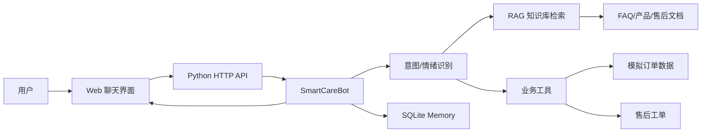

# 端到端智能客服系统课程设计报告

## 一、选题背景与目标

本课程设计选择《深度学习综合实训课程设计选题指南》中的题目 8：端到端智能客服系统。智能客服是自然语言处理最典型的落地场景之一，真实业务中既需要回答常见问题，也需要查询订单、创建售后工单、识别投诉情绪并在必要时转人工。单纯调用大语言模型只能完成“回答文本”这一步，但无法可靠地处理订单状态、售后动作和多轮上下文，因此本项目希望实现一个更接近生产原型的系统。

本项目将业务场景设定为“电商耳机售后客服”，产品包含 XX 蓝牙耳机、YY 游泳耳机和 CC 降噪耳机。系统目标包括：第一，用户可以通过 Web 聊天窗口提出自然语言问题；第二，系统能识别用户意图，将问题路由到 RAG 知识库问答、订单查询、工单创建、转人工等不同处理逻辑；第三，系统能保存多轮对话状态，例如用户上一轮提供了订单号，下一轮只说“换一个吧”时仍能理解上下文；第四，系统能对强烈负面情绪进行安抚并触发高优先级人工转接；第五，系统要提供可复现实验，说明意图识别、工具调用和 RAG 检索的效果。

本题适合 2 人小组完成，因为它不依赖 GPU，也不需要采集真实用户隐私数据，可以通过自建 FAQ、产品说明和模拟订单完成闭环。同时它覆盖课程多个模块：词表示与向量检索、RAG、Prompt Engineering、Function Calling、Agent 路由、Memory、结构化输出和工程化评估。相比只做命令行问答，本项目增加了 Web 界面、完整用户流程和 SQLite 历史记录，满足指南中“产品完整性”加分方向。

## 二、相关技术介绍

### 2.1 RAG 检索增强生成

RAG 的基本思想是“先检索，再生成”。大语言模型自身可能不知道私有知识库中的产品价格、售后政策和物流规则，如果直接回答，容易出现编造。本项目先将 FAQ、产品说明、售后政策和客服流程切分为多个知识块，再根据用户问题检索最相关的 Top-K 片段，最后将检索结果交给回答模块生成客服回复。为了保证本地可运行，项目默认使用标准库实现的 TF-IDF 检索；如果演示机器配置允许，也可以扩展为 Sentence-Transformers + ChromaDB。

TF-IDF 的核心是用词频和逆文档频率表示文本重要性。用户问题和知识块被分词后转成向量，再计算余弦相似度。中文没有空格，本项目采用中文单字、二元词、三元词和英文数字 token 混合的方式增强召回。虽然它不如深度语义向量灵活，但优点是无需下载模型，解释性强，适合课程演示和答辩时讲清楚原理。

### 2.2 意图识别与 Agent 路由

智能客服不能把所有问题都交给同一个回答器。用户说“订单号 2024060112345 到哪了”时，需要调用订单工具；用户说“耳机防水吗”时，需要走知识库；用户说“我要投诉”时，应优先安抚并转人工。本项目把客服系统抽象成一个轻量 Agent：先识别意图、情绪和关键槽位，再选择工具或 RAG 路径。意图类型包括订单查询、退换货、产品咨询、保修、投诉、闲聊、主动转人工和兜底。

### 2.3 Function Calling

Function Calling 的作用是让模型或 Agent 不只是“说”，还可以“做”。本项目模拟了四类工具：`query_order` 查询订单状态，`create_ticket` 创建售后工单，`transfer_human` 转人工，`compare_products` 对比产品。每次工具调用都会以结构化 JSON 展示在前端面板中，便于答辩时说明系统如何从自然语言映射到业务动作。

### 2.4 Memory 多轮记忆

真实客服对话通常不是单轮的。用户可能先说“查一下 2024060112345”，系统返回订单信息后，用户再说“那我想换一个”。如果系统没有记忆，就不知道“换一个”对应哪个订单。本项目用 SQLite 保存消息历史和会话状态，状态字段包括 `last_order_id`、`last_product`、`pending_intent`、`last_issue` 和 `preferred_action`。这种设计让系统能处理追问、补充参数和待确认动作。

### 2.5 情绪识别与兜底策略

客服系统必须避免在用户愤怒时继续机械追问。本项目检测“投诉、破服务、垃圾、气死、再不处理”等负面词，一旦识别为 angry 情绪，就优先道歉、共情，并调用 `transfer_human`，优先级设为 high。对于知识库低置信度问题，系统不编造答案，而是说明无法确认并引导用户补充信息或转人工。

## 三、系统设计

系统采用前后端一体的轻量结构。后端使用 Python 标准库 `http.server` 提供 API，前端使用 HTML、CSS 和 JavaScript 实现聊天界面。这样做的原因是课程演示对稳定性要求较高，减少第三方依赖可以降低安装失败风险。

项目主要模块如下：`vector_store.py` 负责分词、TF-IDF 建库和相似度检索；`knowledge_base.py` 负责加载 Markdown 知识文档并切分知识块；`intent.py` 负责意图、情绪、订单号、产品和动作抽取；`tools.py` 实现订单查询、工单创建、产品对比和转人工；`memory.py` 用 SQLite 管理历史消息、会话状态和工单；`chatbot.py` 是编排核心，决定每轮对话走哪条路径；`web.py` 提供 HTTP API；`static/` 提供前端页面。

## 四、关键实现细节

### 4.1 知识库构建

本项目构造了 7 个知识库文件，包括 32 条 FAQ、XX 蓝牙耳机说明、YY 游泳耳机说明、CC 降噪耳机说明、售后政策、物流政策和智能客服流程设计。系统启动时读取 `data/knowledge/` 下的 Markdown 文件，根据标题和空行切分段落，再对长段落做滑动窗口切分，最终形成知识块。每个知识块保留来源文件、章节名和正文，用于检索和引用。

### 4.2 RAG 检索与引用

RAG 检索默认 `top_k=3`。前端会展示每个引用片段的来源、章节、分数和文本摘要。这样不仅让回答更可信，也方便答辩时解释“系统为什么这样回答”。例如用户问“XX 耳机防水吗？能戴着游泳吗？”，系统会检索到 `faq.md` 和 `product_xx_airbuds.md` 中关于 IPX4 防水的内容，并回答 XX 可以防汗和小雨，但不建议游泳；如果用户需要游泳佩戴，应推荐 YY 游泳耳机。

### 4.3 意图识别与槽位抽取

系统用规则和关键词完成可解释的意图识别。订单号通过正则表达式抽取，售后动作从“退货、退款、换货、维修”等词中抽取，产品名通过别名表归一化，例如“XX耳机”“蓝牙耳机”映射到“XX 蓝牙耳机”。虽然规则方法不如大模型灵活，但在课程演示数据上稳定、可控，而且便于老师追问时解释每个判断依据。后续可以将这部分替换为小型分类模型或 LLM 结构化输出。

### 4.4 工具调用

当识别为订单查询时，系统调用 `query_order`，从 `data/orders.json` 返回商品、承运方、物流单号和预计送达时间。当识别为退换货且订单号和处理方式齐全时，系统调用 `create_ticket` 创建工单，并写入 SQLite。当识别为投诉或主动要求人工时，系统调用 `transfer_human`。工具调用结果以 JSON 形式返回前端，这体现了 Function Calling 中“自然语言 -> 参数 -> 函数 -> 结构化结果 -> 自然语言回复”的完整链路。

### 4.5 多轮状态维护

系统每轮对话都会读取 SQLite 中的 `session_state`。如果用户上一轮提供了订单号，系统会写入 `last_order_id`；如果用户正在退换货但缺少处理方式，会写入 `pending_intent=return_exchange` 和 `last_issue`。下一轮用户只说“换一个吧”时，系统可以沿用上轮订单和问题，创建换货工单。该设计比只保存聊天文本更直接，也更适合工程实现。

### 4.6 Web 交互设计

前端页面分为三栏：左侧是演示场景和运行统计，中间是客服聊天窗口，右侧是本轮路由、工具调用和引用来源。这样设计是为了答辩演示时让老师同时看到“用户体验”和“系统内部决策”。用户不仅能收到回答，还能看到意图、情绪、置信度、工具 JSON 和 RAG 来源，体现系统可解释性。

## 五、实验与评估

### 5.1 20 条测试对话

项目构造了 20 条测试对话，覆盖查物流、缺少参数、退换货、RAG 问答、追问、工具对比、情绪安抚、闲聊和转人工。运行 `python3 run_evaluation.py` 后，生成 `reports/evaluation_results.md`。当前结果为：测试样本数 20，意图识别准确率 100.0%，工具调用正确率 100.0%，RAG 引用命中率 100.0%。这个结果说明在已定义业务范围内，系统能稳定把用户问题路由到正确模块。

需要说明的是，100% 结果来自自建测试集，不代表真实开放环境也能达到同样效果。真实用户表达更复杂，可能出现错别字、口语、省略、多个意图混合等情况。后续可以通过扩展测试集、加入真实客服语料和使用学习型分类器来提高泛化能力。

### 5.2 RAG Top-K 消融实验

项目还构造了 8 个 RAG 检索问题，标注正确资料来源，比较 Top-1、Top-3 和 Top-5 的命中率。运行 `python3 run_rag_ablation.py` 后生成 `reports/rag_ablation.md`。结果显示 Top-1 命中率为 87.5%，Top-3 和 Top-5 命中率均为 100.0%。因此系统默认采用 Top-3：它比 Top-1 更稳，又比 Top-5 更少引入冗余上下文。

### 5.3 有 RAG 与无 RAG 对比

如果没有 RAG，系统只能依赖通用模型或固定模板，回答“XX 能不能游泳”“发票丢了还能不能保修”等问题时容易缺少依据。加入 RAG 后，回答可以引用产品说明和售后政策，并在前端显示来源。对客服系统来说，来源标注比单纯流畅更重要，因为用户和老师都可以检查答案是否来自知识库，而不是模型编造。

### 5.4 失败案例分析

当前系统主要风险有三类。第一，规则意图识别对表达方式敏感，例如用户同时说“快递没到还要退货”时可能需要多意图处理；第二，TF-IDF 对语义相似但字面差异很大的问题召回能力有限，例如“泡水运动耳塞”不一定能召回“游泳耳机”；第三，模拟工具没有真实业务后台，订单和工单只是演示数据。改进方向是引入语义向量模型、使用 LLM 输出 JSON 做意图识别、增加多意图拆解，并接入真实订单接口。

## 六、两人分工

| 成员 | 分工内容 | 产出 |
| --- | --- | --- |
| 成员 A | 选题分析、知识库构建、RAG 检索、意图识别、评估脚本、实验分析 | `data/knowledge/`、`vector_store.py`、`intent.py`、`run_evaluation.py`、实验报告 |
| 成员 B | Web 界面、工具调用、SQLite 记忆、后端 API、README、答辩演示流程 | `static/`、`tools.py`、`memory.py`、`web.py`、README 和演示脚本 |

两位成员共同完成系统联调、报告撰写和答辩排练。答辩时成员 A 重点讲背景、技术原理和实验结果；成员 B 重点讲系统架构、功能演示和工程实现。

## 七、总结与心得

本项目完成了一个可运行、可演示、可评估的端到端智能客服原型。它不是简单调用 API，而是把课程中的多个知识点组合起来：用向量检索解决私有知识问答，用 Agent 路由决定处理路径，用 Function Calling 执行业务动作，用 Memory 处理多轮上下文，用评估脚本验证功能效果。通过这个项目，我们理解到智能客服的难点不只在“生成一句好听的话”，更在于可靠地识别用户要做什么、什么时候调用工具、什么时候不能乱答、什么时候必须交给人工。

后续改进方向包括：使用 Sentence-Transformers 或 BGE 中文向量模型替换 TF-IDF；引入 ChromaDB 或 FAISS 做更大规模向量库；用 Qwen2.5 进行结构化意图识别；增加更多真实客服表达方式和错别字测试；把工单和订单接口改成真实后端服务；增加管理员后台，用于查看工单、分析投诉原因和维护知识库。
